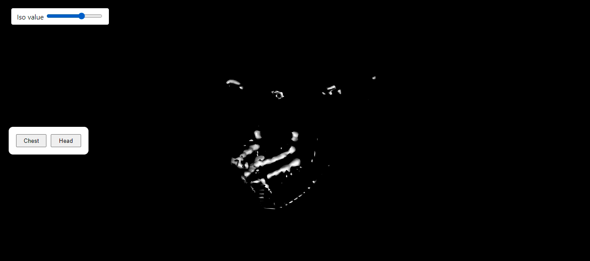
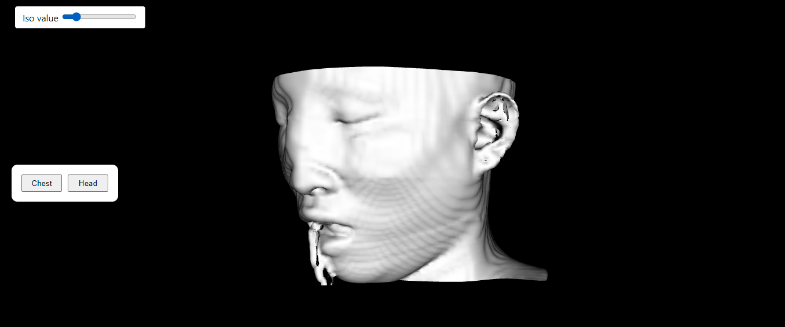
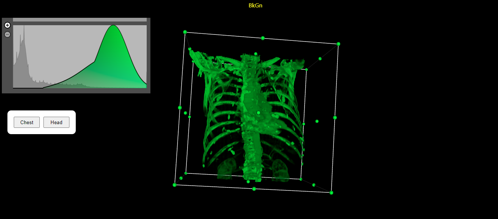
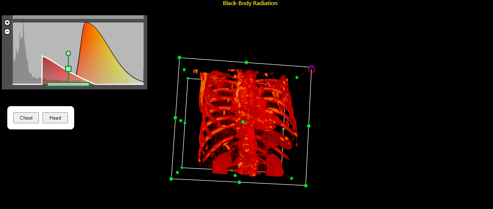

# Medical Data Viewer with VTK

## Detailed implementation:

Using a react app theme, we put the code inside App.js and it is called inside index.js.

Inside App.js:

The data for chest and head images are being loaded into two different readers.

Two different actors and mappers were made for each and rendered in the rendererWindow.

Associated with the head is the iso value slider and with the chest is the cropping widget and the peicewise gaussian widget.

Two buttons were used to transfer between the head and chest scenes.

This happens by changing the visibility of one of the actors to false and the other to true along with their widgets visibility.

## Results:

We can toggle the scene between the chest and head through two buttons and the associated widgets with every scene appears with it.

The head -----> isovalue slider

The chest -----> cropping widget and peicewise gaussian widget

## Problems we faced and how we dealt with it:
 
1. All the medical examples were written with vanilla js, and we wanted to create a react app. So when we tried to embed the examples code, it didn't work.

Solution: we read the cone example (only example that uses react) and we found that the missing part was to put the code inside function App

2. The examples on the website had some errors due to difference in versions.

Solution: we needed to change the imports to '@kitware/vtk.js' instead of 'vtk.js/sources'.

3. Another problem is that at first trial for toggling between scenes, the page would reload from the start, and reload the data every time.

Solution: we built our app to load the data and render them at the beginning, and control the toggling via control the visibility of the actors themselves.

## Future Work:

Put cropping widget control panel.

Enable the user to load DICOM images and choose the algorithm applied on them.

