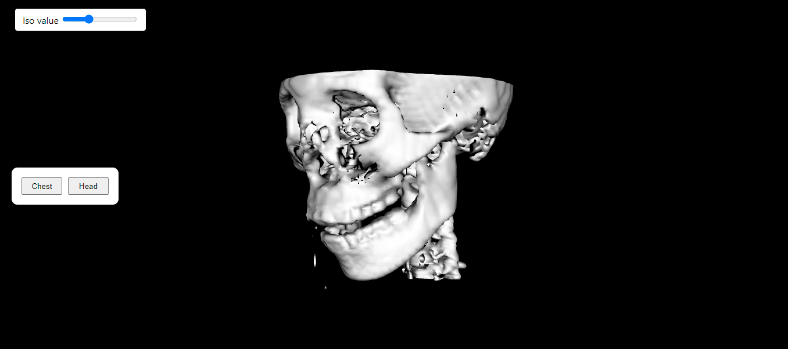

# Medical Data Viewer with VTK

## Detailed implementation:

Using a react app theme, we put the code inside App.js and it is called inside index.js.

Inside App.js:

The data for chest and head images are being loaded into two different readers.

Two different actors and mappers were made for each and rendered in the rendererWindow.

Associated with the head is the iso value slider and with the chest is the cropping widget and the peicewise gaussian widget.

Two buttons were used to transfer between the head and chest scenes.

This happens by changing the visibility of one of the actors to false and the other to true along with their widgets visibility.

## Results:

We can toggle the scene between the chest and head through two buttons and the associated widgets with every scene appears with it.

The head -----> isovalue slider

The chest -----> cropping widget and peicewise gaussian widget

